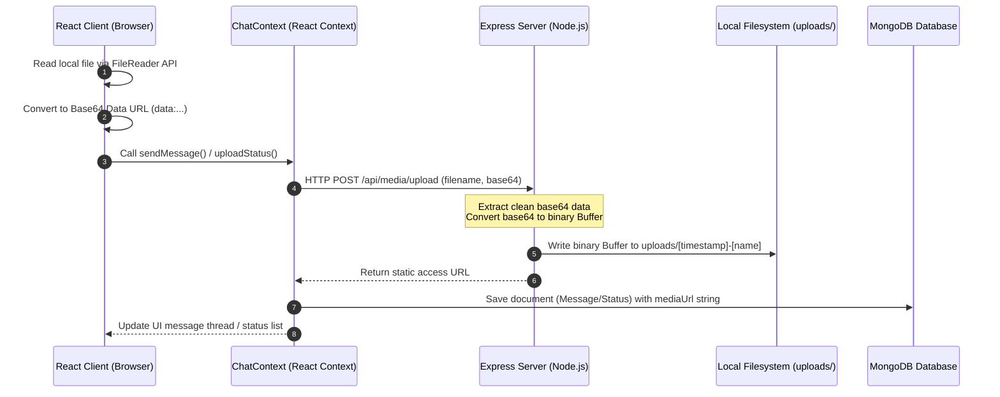
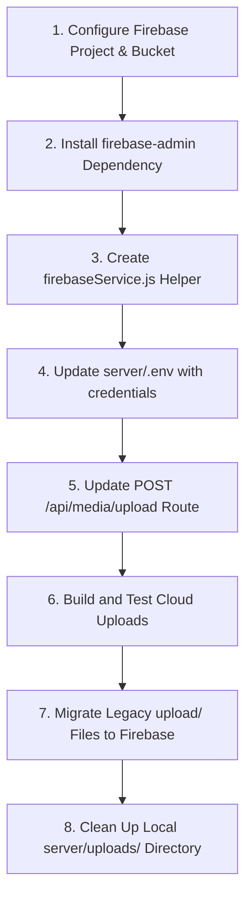

# Media Upload Architecture & Migration Plan

This document details the architecture of the current media upload system in **AetherChat** and outlines a technical migration path for transitioning from local filesystem storage to **Firebase Cloud Storage**.

---

## 🗺️ Current Media Upload Flow



---

## 🔍 System Analysis

### 1. Which files are responsible for uploading media?
- **Frontend**: [ChatContext.jsx](file:///C:/Users/USER/OneDrive/Desktop/bashab/bashab/src/contexts/ChatContext.jsx) contains the helper function `uploadBase64Media()` which makes an `axios.post` request to `/api/media/upload`.
- **Backend**: [app.js](file:///C:/Users/USER/OneDrive/Desktop/bashab/server/app.js) defines the Express `POST /api/media/upload` route handler which decodes the base64 string, converts it to a buffer, and writes it to the disk.

### 2. Which frontend components call the upload API?
Frontend components do not call the upload API directly. Instead, they read files as base64 using the `FileReader` API and pass them to context actions, which execute the upload:
- **[ChatWindow.jsx](file:///C:/Users/USER/OneDrive/Desktop/bashab/bashab/src/components/ChatWindow.jsx)**: Reads attachment inputs (images, audio notes, docs) via `FileReader` and triggers `sendMessage()`.
- **[StatusView.jsx](file:///C:/Users/USER/OneDrive/Desktop/bashab/bashab/src/components/StatusView.jsx)**: Reads media story slides and triggers `uploadStatus()`.

*Note: Component views like [ProfileView.jsx](file:///C:/Users/USER/OneDrive/Desktop/bashab/bashab/src/components/ProfileView.jsx) and [ChannelsView.jsx](file:///C:/Users/USER/OneDrive/Desktop/bashab/bashab/src/components/ChannelsView.jsx) read files as base64 but send them directly to the DB as raw base64 data strings without calling the media upload endpoint.*

### 3. Which backend routes receive uploads?
- **`POST /api/media/upload`**: The primary endpoint for file uploads (receives `{ fileName, fileData }` in the request body).
- **`PUT /api/auth/profile`**: Receives base64 user avatars and cover images and stores them directly in the MongoDB `User` document.
- **`POST /api/channels/:id/post`**: Receives base64 post images and saves them in the `Channel` schema.

### 4. Which controllers process uploads?
The project does not use separate controller files. The upload processing logic is defined inline in [app.js](file:///C:/Users/USER/OneDrive/Desktop/bashab/server/app.js) inside the `POST /api/media/upload` route handler.

### 5. How are files converted before being sent?
The client uses the browser's `FileReader` API (specifically the `readAsDataURL()` method) to read binary files from the user's computer and convert them into base64-encoded strings (formatted as Data URLs: `data:image/png;base64,...`).

### 6. How are files saved in the current uploads folder?
1. The backend extracts the raw base64 characters by stripping the metadata prefix:
   ```javascript
   const cleanBase64 = fileData.replace(/^data:[a-zA-Z0-9-\/]+;base64,/, '');
   ```
2. The decoded base64 string is converted into a binary buffer:
   ```javascript
   const buffer = Buffer.from(cleanBase64, 'base64');
   ```
3. A filename is generated by prefixing the current timestamp to prevent overwrites:
   ```javascript
   const safeName = `${Date.now()}-${fileName.replace(/[^a-zA-Z0-9.-]/g, '_')}`;
   ```
4. The file is written to the local filesystem in the `uploads/` directory:
   ```javascript
   fs.writeFileSync(path.join(uploadDir, safeName), buffer);
   ```

### 7. Which database collections store media references?
- **`messages`**: Stores file links in the `mediaUrl` string attribute.
- **`statuses`**: Stores image links in the `mediaUrl` string attribute of the story.

### 8. Which features depend on this upload system?
- **Direct & Group Chat Messages**: File attachments (audio, images, documents) rely on `uploadBase64Media()`.
- **Status Stories**: Media status posts (images) rely on `uploadStatus()` which invokes `uploadBase64Media()`.

---

## 🚀 Firebase Storage Integration Strategy

### 9. What would need to change if we replaced the local uploads folder with Firebase Storage?
- **Stateless Backend**: Instead of saving binary buffers to the local disk, the backend would upload them to the Firebase Storage cloud bucket using the `firebase-admin` SDK.
- **Public URLs**: The upload endpoint would return Firebase Storage public download URLs (`https://firebasestorage.googleapis.com/...`) instead of local paths.
- **Environment Configuration**: Firebase configurations and service account credentials would be added to the server environment.

### 10. Which files would need to be modified?
- **`server/package.json`**: Add `firebase-admin` as a dependency.
- **`server/.env`**: Add Firebase bucket details (`FIREBASE_STORAGE_BUCKET`) and credential variables.
- **`server/app.js`**: Modify the `POST /api/media/upload` endpoint to invoke the new Firebase service helper instead of utilizing `fs.writeFileSync`.

### 11. Which new files would need to be created?
- **`server/services/firebaseService.js`**: Initialises the Firebase Admin SDK and exports a helper function (e.g. `uploadBuffer(fileName, buffer, mimeType)`) to upload files directly to the storage bucket.
- **`server/firebase-service-account.json`**: A JSON key file containing the service account credentials downloaded from the Firebase Console (excluded from Git using `.gitignore`).

### 12. Which existing files would remain unchanged?
- **Frontend UI Components** (`ChatWindow.jsx`, `StatusView.jsx`): They will continue to convert files to base64 and call the API as usual.
- **Mongoose Database Schemas** (`Message.js`, `Status.js`): They only store URL strings, so they are indifferent to whether the URL points to `localhost` or Firebase.

### 13. What are the risks during migration?
- **API Key Leakage**: Accidentally committing the `firebase-service-account.json` credential file to public Git repositories.
- **Network Latency**: Direct uploads from the server to Firebase can increase response times compared to writing directly to the local disk.
- **MIME Type Detection Mismatches**: Local code does not validate content headers, which could result in corrupt file metadata in the Firebase storage bucket.
- **Dead File References**: Old message records in the database will still point to local `localhost:5000/uploads/` files, causing broken links for old media if those files are not migrated.

---

## 📋 Migration Plan

To perform a safe migration without causing downtime, execute the steps in the following order:



### Phase 1: Preparation & Setup
1. **Configure Firebase**: Create a project in the Firebase Console, enable Storage, and download the Service Account Private Key JSON file. Save it to `server/firebase-service-account.json`.
2. **Add to `.gitignore`**: Add `firebase-service-account.json` to `.gitignore` to prevent committing secrets to version control.
3. **Install Dependencies**: Run `npm install firebase-admin` in the `server/` directory.

### Phase 2: Implementation
4. **Create `firebaseService.js`**: Create the service file in `server/services/`:
   ```javascript
   const admin = require('firebase-admin');
   const serviceAccount = require('../firebase-service-account.json');

   admin.initializeApp({
     credential: admin.credential.cert(serviceAccount),
     storageBucket: process.env.FIREBASE_STORAGE_BUCKET
   });

   const bucket = admin.storage().bucket();

   const uploadBuffer = async (fileName, buffer, mimeType) => {
     const file = bucket.file(fileName);
     await file.save(buffer, {
       metadata: { contentType: mimeType },
       public: true
     });
     return file.publicUrl();
   };

   module.exports = { uploadBuffer };
   ```
5. **Update `app.js`**: Import `firebaseService` and update the `POST /api/media/upload` route handler:
   ```javascript
   const { uploadBuffer } = require('./services/firebaseService');

   app.post('/api/media/upload', authenticateToken, async (req, res) => {
     const { fileName, fileData } = req.body;
     if (!fileName || !fileData) return res.status(400).json({ error: 'Data required' });
     try {
       const mimeType = fileData.match(/^data:([a-zA-Z0-9-\/]+);base64,/)?.[1] || 'application/octet-stream';
       const cleanBase64 = fileData.replace(/^data:[a-zA-Z0-9-\/]+;base64,/, '');
       const buffer = Buffer.from(cleanBase64, 'base64');
       const safeName = `${Date.now()}-${fileName.replace(/[^a-zA-Z0-9.-]/g, '_')}`;

       // Upload directly to Firebase Storage
       const fileUrl = await uploadBuffer(safeName, buffer, mimeType);
       res.json({ fileUrl });
     } catch (err) {
       console.error('Firebase upload failed:', err);
       res.status(500).json({ error: 'Cloud upload failed' });
     }
   });
   ```

### Phase 3: Testing & Cleanup
6. **Integration Verification**: Verify that sending chat attachments and status stories uploads files directly to Firebase.
7. **Legacy Media Migration**: Run a one-time migration script to upload existing files in the local `server/uploads/` directory to the Firebase bucket, and update the matching URLs in the MongoDB collections.
8. **Deprecate Local Directory**: Disable local static serving in `app.js` and delete the `server/uploads/` directory.
